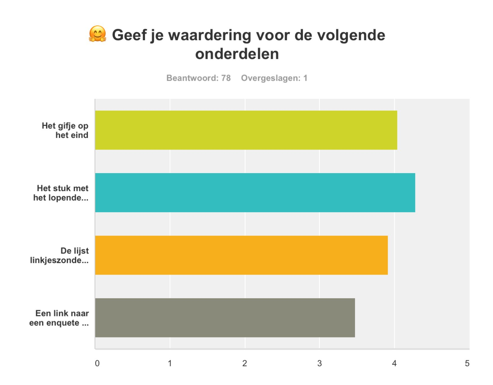
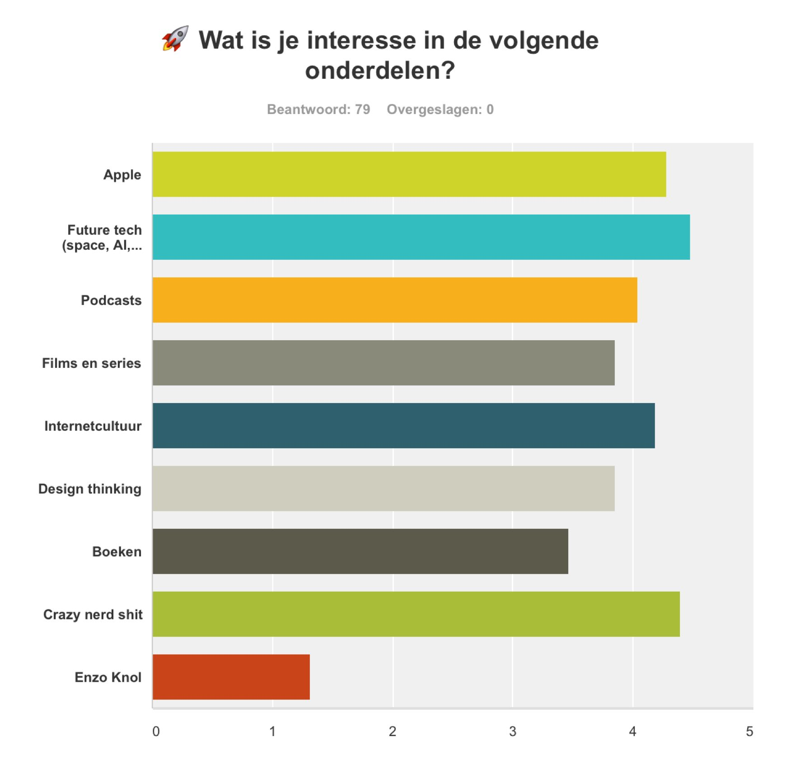
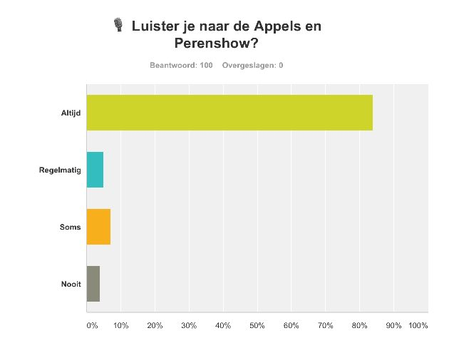

# Uitkomsten van de eerste 82% enquête

Het is niet de bedoeling dat ik elke week een enquête uitvoer, helemaal niet. Maar ik vind het wel leuk om zo af en toe eens een vinger aan de pols te houden. Enige interactie met de abonnees is wel leuk. En om gelijk maar een zorg van een lezer weg te nemen:

> "Ik heb de lage score bij de laatste vraag van deel 2 gegeven omdat ik juist geen invloed op de nieuwsbrief wil!"

Ik ben niet 100% ongevoelig voor enige feedback natuurlijk maar de nieuwsbrief is uiteindelijk gewoon een uitlaatklep voor alles wat ik door de week heb gelezen en bekeken. Mijn interesse verandert er niet door en ik blijf graag delen.

## De cijfers

Net geen 4,5. Dat kan beter volgende keer!

Erg goed om te lezen dat het stuk waar de meeste tijd in gaat zitten het beste wordt gewaardeerd.

De dingen die ik zelf het leukste vind komen hier erg hoog, fijn!

Ik had hier eigenlijk verwacht dat de nieuwsbrief ook een hoop abonnees zou hebben die niet naar de Appels en Peren Show luisteren. Wrong guess.

## Selectie van opmerkingen

> “Ik kijk elke week weer uit naar de 82% nieuwsbrief. Een heerlijk begin van 't weekend. Ga vooral zo door!”

☺️ Heel veel van dittum, erg fijn om te lezen 

> “Erg leuk dat je dit doet. Vraag me af waar je de tijd vandaan haalt om dit te verzamelen. Heb je alle stukken ook gelezen?”

🤓 Bijna alles heb ik wel gelezen of gezien. Soms staan er een paar dingen in de linkdump die ik zelf (nog) niet gelezen heb maar waarvan de potentie hoog is en ik allemaal mensen erover heb gehoord. Daarnaast maak ik elke vrijdag erg veel tijd vrij om dit te doen, daarom sla ik ook liever een week over dan een half brakke editie af te leveren.

> “Popsalon!”

😑 Ja, je leest het hier voor het eerst, maar ik ben een beetje klaar met de zoet/zout combinatie van dingen. Ook de karamelzeezout van Tony Chocolonely’s is me niet meer dierbaar… 

> “Lost-ep-AEPP_mixdown.mp3”

😏
